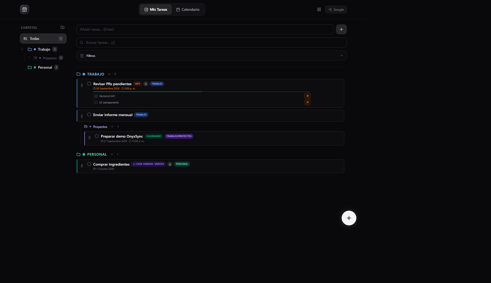
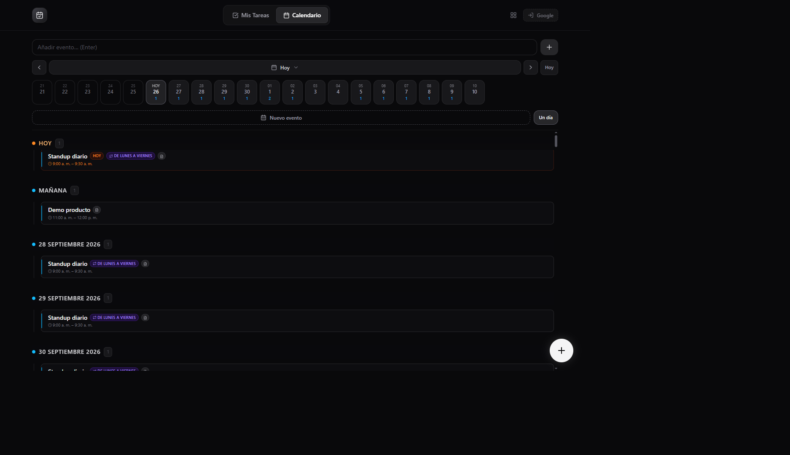
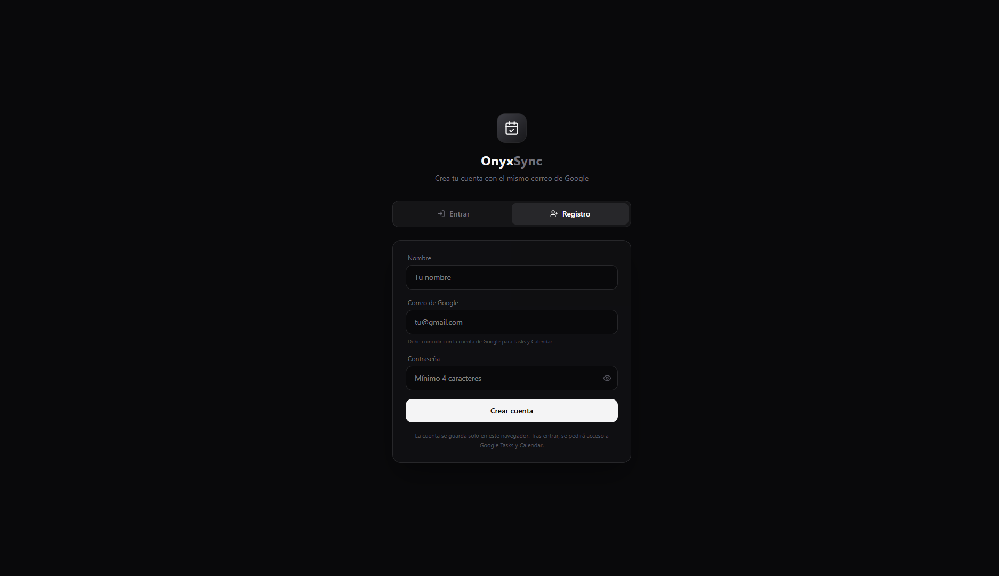
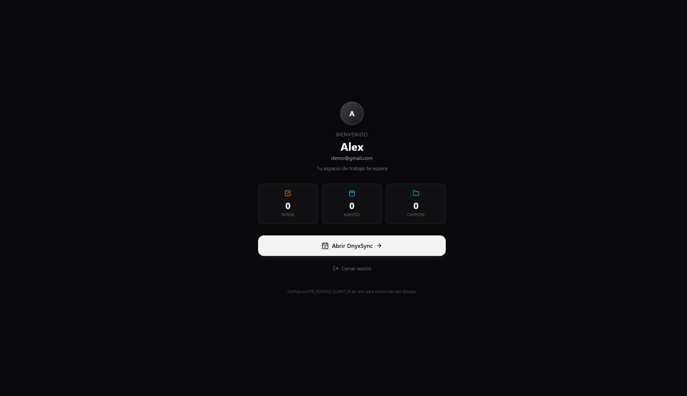

# OnyxSync

**Planificador personal que une tareas, carpetas y calendario en una sola interfaz oscura**, con sincronización opcional a Google Tasks y Google Calendar.

Organiza el día sin saltar entre apps: gestiona listas jerárquicas, fija plazos y recurrencias, y ve tus eventos en una línea de tiempo clara.

<p align="center">
  
</p>

---

## ¿Qué es?

OnyxSync es una app web (React + Vite) pensada para trabajo y vida personal:

- **Mis Tareas** — carpetas y subcarpetas con colores, subtareas, adjuntos, filtros y drag & drop
- **Calendario** — agenda por día con eventos puntuales y recurrentes
- **Cuenta local** — registro en el navegador; el correo se alinea con Google para sincronizar
- **Google Sync** — importa Tasks y Calendar cuando configuras OAuth

<p align="center">
  
</p>

---

## Capturas

| Login / registro | Lobby |
| :---: | :---: |
|  |  |

| Mis Tareas | Calendario |
| :---: | :---: |
|  |  |

---

## Características

- Carpetas anidadas con contadores y colores
- Arrastrar para reordenar o mover tareas entre carpetas
- Búsqueda, filtros por plazo, recurrencia, subtareas y más
- Subtareas, adjuntos y recurrencia (diaria, semanal, laborables…)
- Convertir una tarea en evento de calendario
- Atajos: `N` nueva tarea, `/` buscar, `Esc` cerrar
- Persistencia por usuario en `localStorage`
- Tema oscuro nativo

---

## Inicio rápido

**Requisitos:** Node.js 18+ y npm 9+

```bash
git clone https://github.com/codeonyx-dev/OnyxSync.git
cd OnyxSync
npm install
npm run dev
```

Abre la URL que muestra Vite (por defecto **http://localhost:3080**).

> **Windows (PowerShell):** si `npm` falla por política de ejecución, usa `npm.cmd run dev`.

| Comando | Descripción |
|---------|-------------|
| `npm run dev` | Desarrollo con recarga en caliente |
| `npm run build` | Build de producción |
| `npm run preview` | Previsualizar el build |

---

## Stack

| Tecnología | Uso |
|------------|-----|
| React 19 | UI |
| Vite 6 | Bundler y servidor de desarrollo |
| Tailwind CSS 4 | Estilos |
| TypeScript | Tipado |
| @dnd-kit | Drag & drop |
| @react-oauth/google | Login Google |
| lucide-react | Iconos |

---

## Google OAuth (opcional)

1. En [Google Cloud Console](https://console.cloud.google.com/) crea un proyecto
2. Activa **Google Tasks API** y **Google Calendar API**
3. Crea un **ID de cliente OAuth 2.0** (aplicación web)
4. Orígenes y redirección: `http://localhost:3080` (y tu dominio en producción)
5. Crea `.env` en la raíz:

```env
VITE_GOOGLE_CLIENT_ID=tu-id.apps.googleusercontent.com
```

6. Reinicia `npm run dev`

Sin Client ID la app funciona igual en local; solo se desactiva la sincronización con Google.

---

## Documentación técnica

Detalle de arquitectura, módulos y estructura del código: **[OnyxSync.md](./OnyxSync.md)**

---

*OnyxSync v1.0.0*
